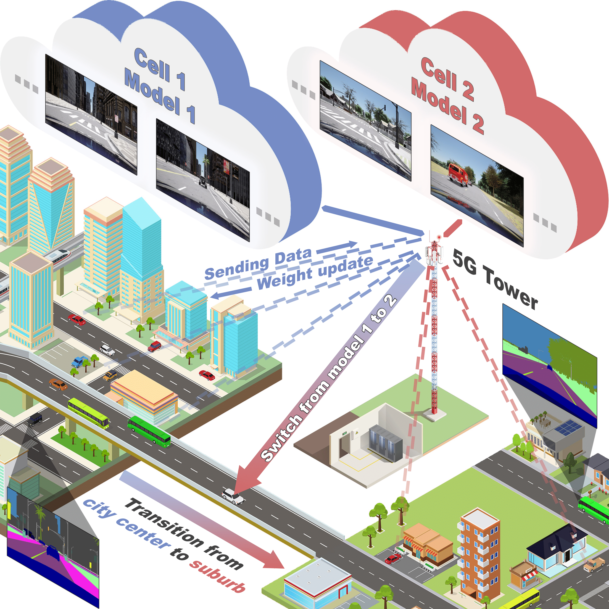
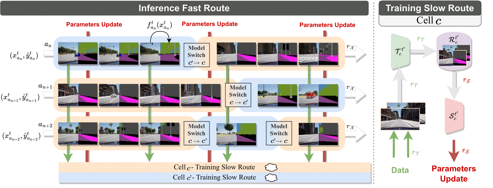

#  Multi-Stream Cellular Test-Time Adaptation of Real-Time Models Evolving in Dynamic Environments

<div align="center">
<div></div>
 
</div>

This repository provides the implementation of our paper (add link to paper), presented at CVPR WAD 2024.


## DADE Dataset

Please follow our other repository to download and install the [DADE dataset](https://github.com/ULiege-driving/DADE).

## Environment and preparation
We first need to create the Python environment:

```bash
conda create -y --name MSC python=3.9.18
conda activate MSC
```
Navigate inside the repository and install the required libraries:

```bash
cd MSC-TTA
pip3 install -r requirements.txt
```
Create symbolic links to the datasets, a storage folder for pretrained model weights and a storage folder to save confusion matrices:
```bash
cd MSC-TTA
ln -s path/to/DADE/ data
ln -s path/to/pretrained/weights/storage/ pretrained
ln -s path/to/confusion/matrices/storage/ confusion_matrices
```

## Generating pseudo labels

If you wish to only work with CARLA ground truth, you can skip this step. To obtain pseudo-labels from out of the shelf models, you can install the `MMSegmentation` library by following [the instructions](https://mmsegmentation.readthedocs.io/en/latest/get_started.html). As it is only performed once, you can create a separated Python environment for this step.

In a second time, download the checkpoint of the desired teacher model and move it to `MSC-TTA/src/mmsegmentation/checkpoints/`. In our work, we employed SegFormer for the teacher model (`segformer_mit-b5_8x1_1024x1024_160k_cityscapes_20211206_072934-87a052ec.pth`).

Then, we generate the pseudo-labels by infering with the teacher model. Here is an example to infer SegFormer on DADE-static and store pseudo-labels in `.png` format:

```bash
cd MSC-TTA/src/preprocessing
python teacher_inference.py --dataset ../data/static_weather --teacher segformer
```

Finally, you have to pre-transform the pseudo-labels into `.npz` files. This ensures the pseudo-labels to match the CityScapes class definition:  

```bash
python project_all_to_common_labels.py --dataset ../data/static_weather
```


## Pretraining

This step is not mandatory if you only want to adapt models from scratch. The `pretrain.sh` script shows an example to pretrain 7 models (one per location) on the two-first hours of DADE-static.

```bash
bash pretrain.sh
```

Similarly, you can call `pretraining_dynamic.py` to obtain pretrained models on DADE-dynamic. Please check the `--help` flag for more options.

## Adaptation

<div align="center">
<div></div>
 
</div>

The `adapt.sh` script provide an example to adapt 7 models from scratch on the three-last hours of DADE-static. Per default, the configuration does not save confusion matrices and simply logs the accumulated mIoU over the adaptation period.
```bash
bash adapt.sh
```


## Citation

If you find this dataset useful in your research, please consider citing:

- the MSC-TTA paper: 
```bibtex
@inproceedings{Gerin2024MultiStream,
        title = {Multi-Stream Cellular Test-Time Adaptation of Real-Time Models Evolving in Dynamic Environments},
        author = {G\'erin, Beno{\^{\i}}t and Halin, Ana{\"\i}s and Cioppa, Anthony and Henry, Maxim and Ghanem, Bernard and Macq, Beno{\^{\i}}t and De Vleeschouwer, Christophe and Van Droogenbroeck, Marc},
        booktitle = {IEEE International Conference on Computer Vision and Pattern Recognition Workshops (CVPRW)},
        month = {June},
        year = {2024},
        address = {Seattle, Washington, USA}
}
```

- the DADE dataset:
```bibtex
@data{Halin2023DADE,
  author    = {Halin, Ana\"is and G\'erin, Beno\^it and Cioppa, Anthony and Henry, Maxim and Ghanem, Bernard and Macq, Beno\^it and De Vleeschouwer, Christophe and Van Droogenbroeck, Marc},
  publisher = {ULi\`ege Open Data Repository},
  title     = {{DADE dataset}},
  year      = {2023},
  version   = {V1},
  doi       = {10.58119/ULG/H5SP5P},
  url       = {https://doi.org/10.58119/ULG/H5SP5P}
}
```

## License
[AGPL-3.0](https://github.com/ULiege-driving/MSC-TTA/blob/main/LICENSE)
